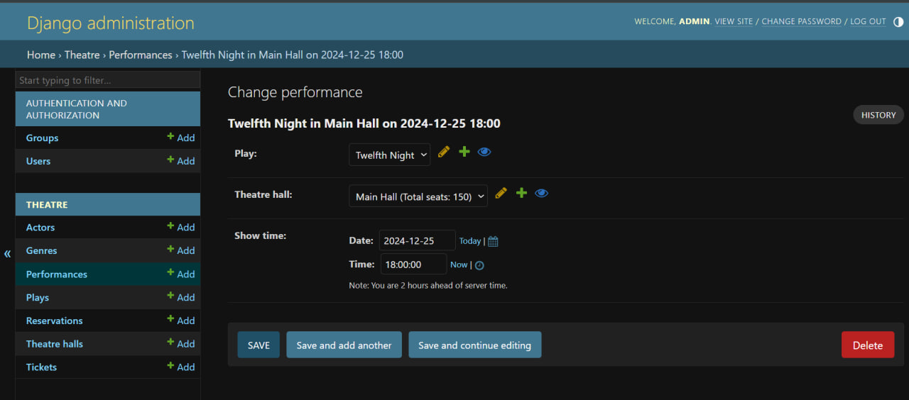
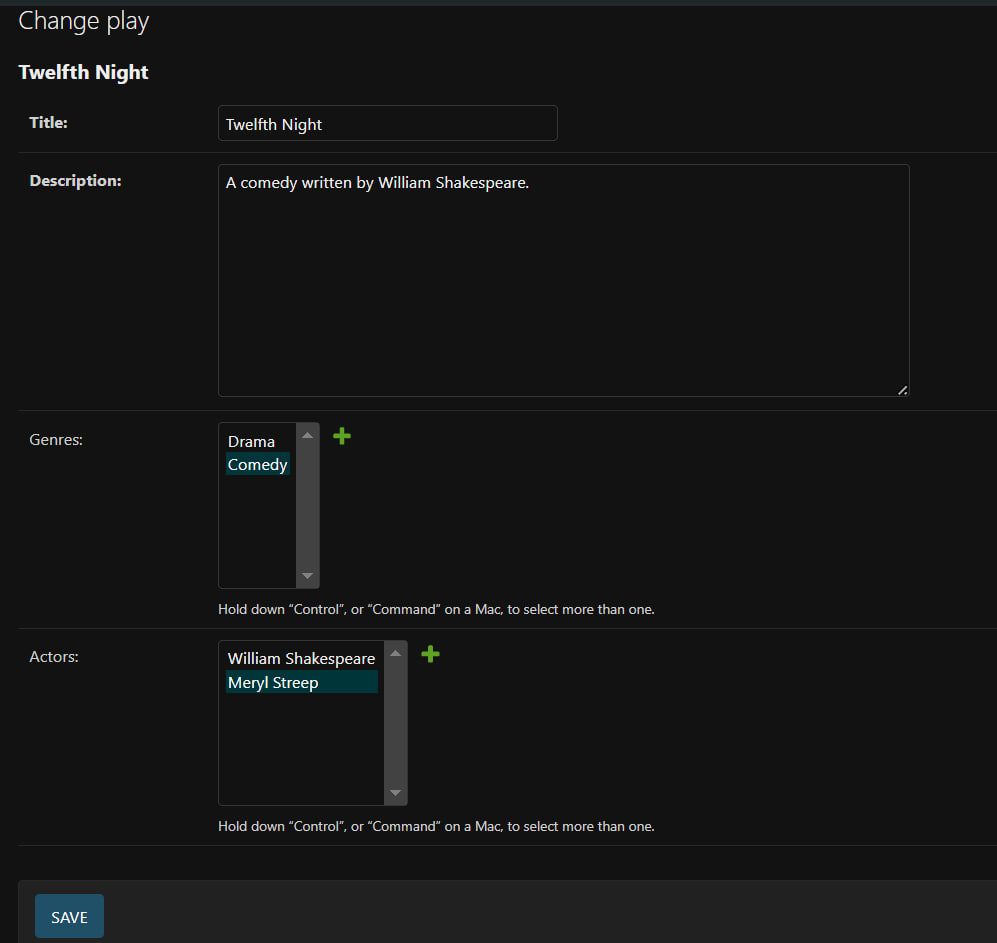
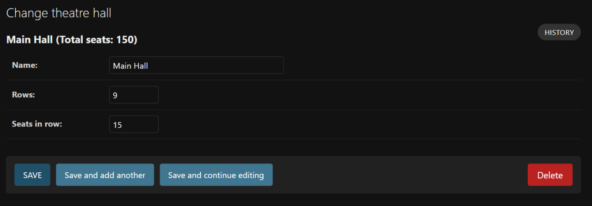
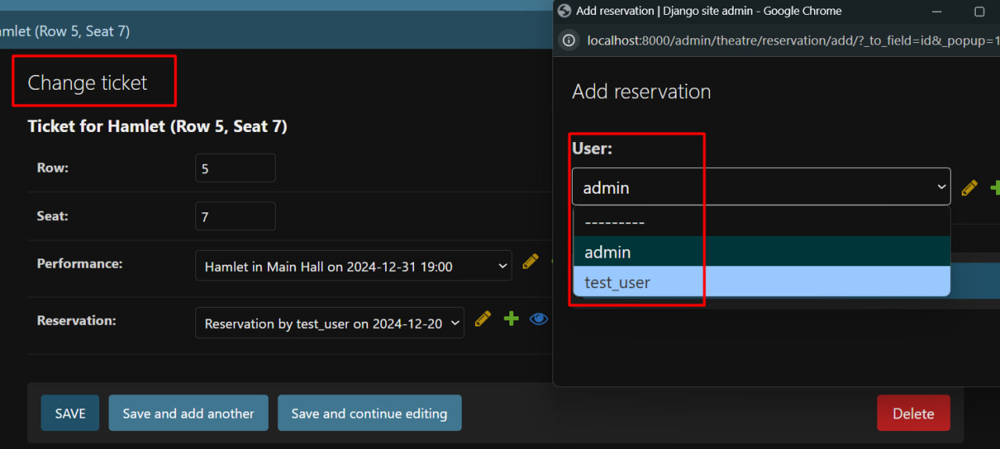

# Theatre API

Theatre API is a web application for managing a theatre, 
allowing users to view and manage performances, book tickets, 
and administer schedules. The application features user authentication, 
permission management, and administrative functionalities 
for handling theatre-related operations.

## Table of Contents
- [Technologies](#technologies)
- [Installation and Setup](#installation-and-setup)
- [Using Docker](#using-docker)
- [Running Tests](#running-tests)
- [API Documentation](#api-documentation)
- [Using the Application](#using-the-application)
- [Authorization and Authentication](#authorization-and-authentication)

## Technologies
- Django: The main web framework.
- Django REST Framework: Used for building the API.
- PostgreSQL: Database for production; SQLite for development.
- Django JWT: For user authentication using JSON Web Tokens.
- Pillow: For image handling.

## Installation and Setup
Clone the repository:
```bash
git clone https://github.com/yulia-pl/theatre-api.git
cd theatre-api
```

## Create and activate a virtual environment: For Windows:
```bash
python -m venv venv
venv\Scripts\activate
```
For MacOS/Linux:
```bash
python3 -m venv venv
source venv/bin/activate
```
Install the required packages:
```bash
pip install -r requirements.txt
```
Set up the database: For development, SQLite is already configured. 
For production, update the database configuration in settings.py 
with PostgreSQL credentials. Run migrations:
```bash
python manage.py migrate
```
Create a superuser (optional):
```bash
python manage.py createsuperuser
```
Run the server:
```bash
python manage.py runserver
```

## Using Docker
If you prefer to use Docker for setting up the project, follow these steps: 
Ensure Docker and Docker Compose are installed. Build and run the containers:
```bash
docker-compose up --build
```
Access the application at: http://localhost:8000 Run migrations within 
the Docker container (if needed):
```bash
docker-compose exec web python manage.py migrate
```
## Create a superuser in the Docker container (optional):
```bash
docker-compose exec web python manage.py createsuperuser
```
## Running Tests
Run the following command to execute tests:
```bash
docker-compose exec web python manage.py test
```

This project is available as a Docker image on Docker Hub. 
To use the Dockerized version of the project, follow these steps:
To pull the prebuilt Docker image from Docker Hub, run:
```bash
docker pull yulia2506/theatre-api:latest
```
Run the container using the following command:
```bash
docker run -p 8000:8000 yulia2506/theatre-api:latest
```

## A little visualization of the work
##  1.

## 2.

## 3.

## 4.
